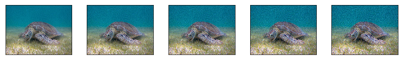
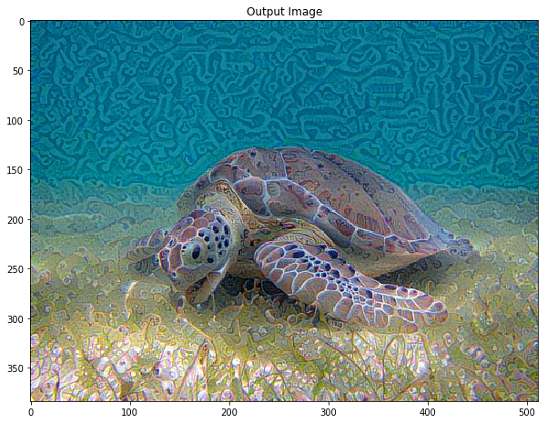

[](https://opensource.org/licenses/Apache-2.0)
[](https://github.com/th35tud3nt/neural-style-art)

# neural-style-art (NST - Neural Style Transfer )
Neural Style Transfer refers to a kind of software algorithm that manages images or videos, to transfer the visual style of another image. NST algorithms are characterized by their use of deep neural networks for image transformation.

# special thanks
This project is inspired by the following articles which, if you are interested in the subject, I recommend you read a lot, they are extremely interesting.
Special thanks to the article [Neural Style Transfer: Creating Art with Deep Learning using tf.keras and eager execution](https://medium.com/tensorflow/neural-style-transfer-creating-art-with-deep-learning-using-tf-keras-and-eager-execution-7d541ac31398) by **Raymond Yuan**, thanks to these project provided a lot of support and inspiration. Please visit their repositories you may be interested to you. [Neural Style Transfer with Swift for TensorFlow](https://medium.com/@build_it_for_fun/neural-style-transfer-with-swift-for-tensorflow-b8544105b854), [Walking through Neural Style Transfer with Weights & Biases](https://medium.com/@weights_biases/walking-through-neural-style-transfer-with-weights-biases-95bdfb89b79c) and [Neural Style Transfer (Part 1)](https://medium.com/@stanleydukor/neural-style-transfer-part-1-e82c2e774443)

# Requirements

The project can be used with **python2.7** for to build. The most recommended is to use version 2.7 within a virtual environment, since this version is already deprecated, you can install python2.7 on a virtual environment you can use **virtualenv** or **pipenv**. To run the version of the script with tkinter you need the **tk** package. Also to run this project successfully, you need to have **jupyter** **notebook** installed on your computer.

# Notes
 -  Tensor : (Algebraic entity of several components, which generalizes the concepts of scalar, vector and matrix)
 -  __Tensorflow__ :( Automatic learning through a range of tasks with the ability to build and train 
 neural networks to detect and decipher patterns and correlations, analogous to learning and 
 reasoning used by humans )
 -  __Keras__: ( Neural Network Manipulator, Helps experiment with Deep Learning Networks )
    Keras is a model level library, providing high level building blocks for the 
    development of models of deep learning. It does not handle low-level operations such as products 
    tensioners, convolutions, etc. Instead, it is based on a specialized and well-optimized library of 
    manipulating tensors to do so, serving as Keras "backend engine". Instead of choosing a 
    single library of tensors and make the Keras implementation link to that library, Keras handles the 
    problem in a modular way, and several different backend motors can be connected to Keras without any problem

# Pip packages
 - __jupyterlab__
 - __matplotlib__
 - __numpy__
 - __pandas__
 - __Pyllow__
 - __tensorflow__
 - __tensorflow-gpu__
 - __keras__
 
### Works Optimizer Adam from tensorflow Again Xd

```python
# works Adam YEA!
best, best_loss = run_style_transfer(content_path, style_path, num_iterations=5)
```



```python
Image.fromarray(best)
```


```python
def show_results(best_img, content_path, style_path, show_large_final=True):
    plt.figure(figsize=(10, 5))
    content = load_img(content_path) 
    style = load_img(style_path)
    
    plt.subplot(1, 2, 1)
    imshow(content, 'Content Image')

    plt.subplot(1, 2, 2)
    imshow(style, 'Style Image')

    if show_large_final: 
        plt.figure(figsize=(10, 10))

    plt.imshow(best_img)
    plt.title('Output Image')
    plt.show()
```


```python
show_results(best, content_path, style_path)
```




# Aditional Note:
This project is a fork of [https://github.com/tensorflow/models/tree/master/research/nst_blogpost](https://github.com/tensorflow/models/tree/master/research/nst_blogpost)

When you increase the number of iterations of the execution of the transfer style function, the need for computing is greater and for optimal results you need a little more computing  resources in my case take advantage of a virtual machine in azure (Ubuntu 18.04, core i7, 16GB RAM), depending on the number of iterations is the time to run the script.
    
```sh
# Connect to the server using SSH tunneling
$ ssh username@xx.xx.xx.xx -NL 1234:localhost:1234 
$ jupyter notebook --no-browser --port 1234
```
